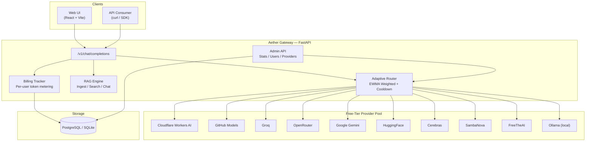
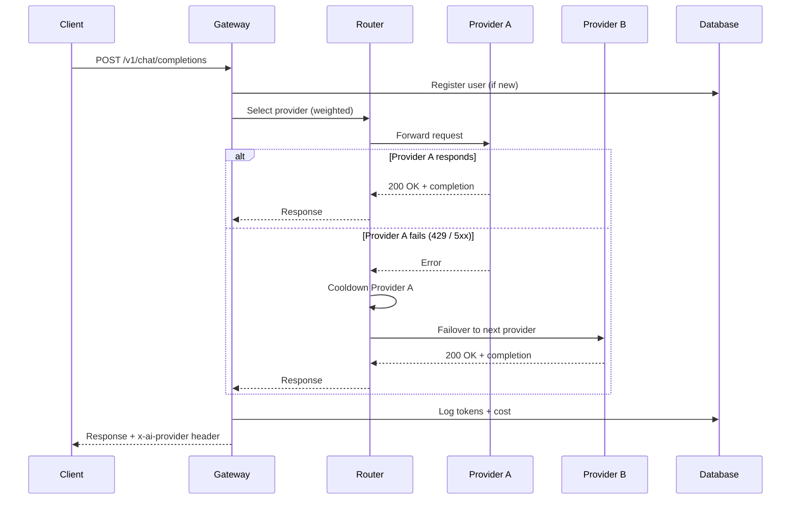
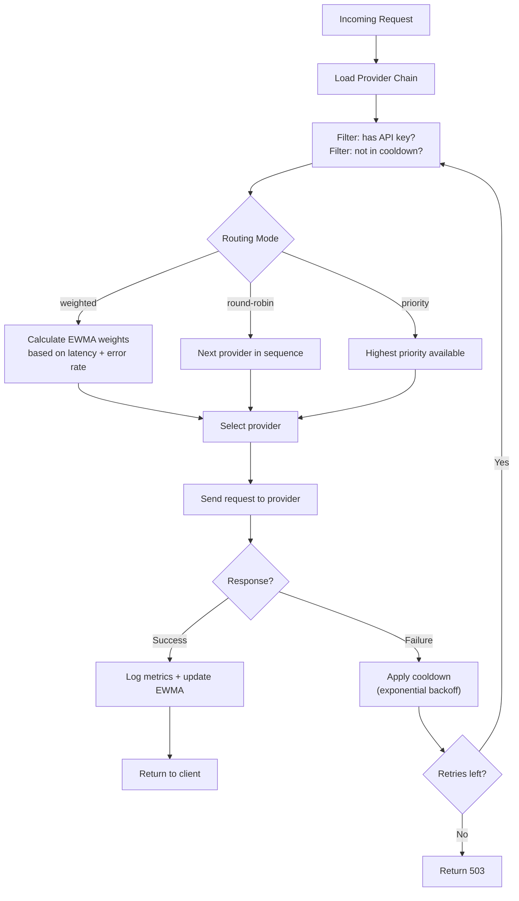
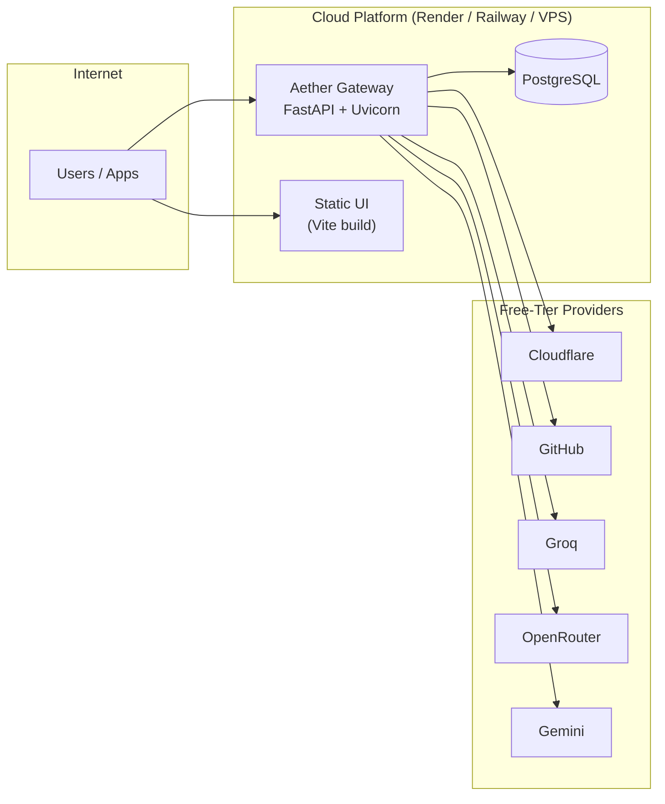

# Aether Protocol — Multi-Provider AI Gateway

A self-hosted, zero-cost AI gateway that unifies 10+ free-tier LLM providers behind a single OpenAI-compatible endpoint. Features adaptive weighted routing, automatic failover, per-user billing, RAG integration, and a cinematic admin dashboard.

---

## Architecture



---

## Request Lifecycle



---

## Routing Algorithm



---

## Provider Matrix

| Provider           | Free Tier Limit            | Latency   | Models                                    |
| ------------------ | -------------------------- | --------- | ----------------------------------------- |
| Cloudflare AI      | 10,000 neurons/day         | ~200ms    | Llama 3/4, Mistral, Qwen, DeepSeek-R1    |
| GitHub Models      | 50 req/day (high tier)     | ~300ms    | GPT-4o, Claude Sonnet 4, Grok 3, DeepSeek |
| Groq               | 14,400 req/day             | ~80ms     | Llama 3.x, Gemma 2, Mixtral              |
| OpenRouter         | Rate-limited free models   | ~400ms    | 150+ free models across 20+ providers     |
| Google Gemini      | 1,500 req/day              | ~250ms    | Gemini Flash, Gemini Pro                  |
| HuggingFace        | Rate-limited               | ~500ms    | 100,000+ open models                     |
| Cerebras           | Generous free tier          | ~50ms     | Llama 3.x (2000+ tok/s)                  |
| SambaNova          | Community tier              | ~100ms    | Llama 3.x, Mistral                       |
| FreeTheAI          | Rate-limited               | ~350ms    | Kimi K2.6, DeepSeek-V3, Grok Imagine     |
| Ollama             | Unlimited (local)          | ~150ms    | Any GGUF model                           |

---

## Quick Start

### 1. Clone and install

```bash
git clone https://github.com/nleins5/free-ai-gateway.git
cd free-ai-gateway

python3 -m venv venv
source venv/bin/activate
pip install -r requirements.txt
```

### 2. Configure environment

```bash
cp .env.example .env
# Edit .env — fill in API keys for providers you have
# Providers without keys are automatically excluded from routing
```

### 3. Start the gateway

```bash
uvicorn app.main:app --host 0.0.0.0 --port 8000
```

### 4. Start the Web UI (optional)

```bash
cd ui
npm install
npm run dev
```

### 5. Access

| Service         | URL                        |
| --------------- | -------------------------- |
| API endpoint    | `http://localhost:8000`     |
| Web Chat UI     | `http://localhost:5173`     |
| Admin Dashboard | `http://localhost:5173/admin` |

---

## API Reference

### Chat Completion

```bash
curl http://localhost:8000/v1/chat/completions \
  -H "Content-Type: application/json" \
  -d '{
    "model": "smart-chat",
    "messages": [{"role": "user", "content": "Explain microservices"}],
    "temperature": 0.3
  }'
```

The response includes routing metadata:

- Header: `x-ai-provider`, `x-ai-model`
- Body: `router.provider`, `router.model`

### Model Aliases

| Alias            | Behavior                                  |
| ---------------- | ----------------------------------------- |
| `smart-chat`     | Auto-select best available provider       |
| `gemma-fast`     | Prefer speed (small models)               |
| `gemma-quality`  | Prefer quality (27B+ models)              |
| `cf-dynamic`     | Force Cloudflare AI Gateway dynamic route |

### RAG Endpoints

```bash
# Ingest documents
POST /v1/rag/ingest

# Search context
POST /v1/rag/search

# Chat with RAG context
POST /v1/rag/chat
```

### Image Generation

```bash
POST /v1/images/generations
```

### Router Diagnostics

```bash
# View model alias mappings
GET /router/models

# View router health state + cooldowns
GET /router/state

# Prometheus-style metrics
GET /metrics
```

### Admin API (requires X-Admin-Key header)

```bash
# Aggregate stats
GET /v1/admin/stats

# Provider details
GET /v1/admin/providers

# User billing data
GET /v1/admin/users
```

---

## Admin Dashboard

The admin panel provides real-time system telemetry:

- **Neural Load** — Total requests routed through the gateway
- **Signal Latency** — EWMA-weighted average response time across providers
- **Token Economy** — Accumulated cost tracking with budget enforcement
- **Provider Matrix** — Live status, latency, load distribution per provider
- **User Billing Ledger** — Per-user request counts, token usage, and revenue tracking
- **System Console** — Real-time routing and health event logs

Access via `http://localhost:5173/admin` with your `ADMIN_SECRET` key.

---

## Configuration

### Key environment variables

| Variable                   | Description                                    | Default                          |
| -------------------------- | ---------------------------------------------- | -------------------------------- |
| `PROVIDER_CHAIN`           | Comma-separated provider order                 | `cloudflare,github,groq,...`     |
| `ROUTING_MODE`             | `weighted`, `round-robin`, or `priority`       | `weighted`                       |
| `ADAPTIVE_ROUTING`         | Enable EWMA-based adaptive weight adjustment   | `1`                              |
| `ADAPTIVE_LATENCY_ALPHA`   | EWMA smoothing factor                          | `0.3`                            |
| `PROVIDER_WEIGHTS_JSON`    | Baseline traffic share per provider            | `{"cloudflare":4,"github":2}`   |
| `PROVIDER_FAILURE_THRESHOLD` | Consecutive failures before cooldown         | `3`                              |
| `PROVIDER_COOLDOWN_S`      | Cooldown duration in seconds                   | `60`                             |
| `BUDGET_LIMIT_USD`         | Daily budget cap (0 = unlimited)               | `0`                              |
| `ADMIN_SECRET`             | Admin dashboard authentication key             | (required)                       |
| `DATABASE_URL`             | PostgreSQL connection string                   | `sqlite+aiosqlite:///local.db`   |

### Provider keys

Fill in only the providers you have access to. Missing keys are silently skipped:

```env
CLOUDFLARE_API_TOKEN=...
CLOUDFLARE_ACCOUNT_ID=...
GITHUB_PAT=ghp_...
GROQ_API_KEY=gsk_...
OPENROUTER_API_KEY=sk-or-...
GEMINI_API_KEY=...
HF_TOKEN=hf_...
CEREBRAS_API_KEY=...
SAMBANOVA_API_KEY=...
FREETHEAI_API_KEY=...
```

---

## Deployment

### Render (recommended for free hosting)

The project includes a `render.yaml` blueprint:

```bash
# Push to GitHub, then connect repo in Render dashboard
# render.yaml auto-configures the web service
```

### Docker

```bash
docker build -t aether-gateway .
docker run -p 8000:8000 --env-file .env aether-gateway
```

### Production Topology



---

## Project Structure

```
free-ai-gateway/
  app/
    main.py              # FastAPI application entry point
    api/
      v1/
        chat.py          # Chat completions + user billing
      admin.py           # Admin dashboard API
    services/
      router.py          # Adaptive weighted router
      rag.py             # RAG engine (ingest, search, chat)
  ui/
    src/
      pages/
        Chat.jsx         # Chat interface
        Admin.jsx        # Admin telemetry dashboard
      App.jsx            # Router + layout
  providers.json         # Provider configuration
  .env.example           # Environment template (safe to commit)
  Dockerfile             # Container build
  render.yaml            # Render deployment blueprint
```

---

## Cost Analysis

| Scenario                  | Traditional API Cost | Aether Gateway Cost | Savings |
| ------------------------- | -------------------- | ------------------- | ------- |
| 1,000 requests/day        | ~$3.00/day           | $0.00               | 100%    |
| 10,000 requests/day       | ~$30.00/day          | $0.00 - $0.50       | 98%+    |
| Production (50K req/day)  | ~$150.00/day         | $2.00 - $5.00       | 96%+    |

The gateway achieves 90-95% cost reduction by intelligently routing across free tiers and only falling back to paid providers when all free options are exhausted.

---

## License

MIT
