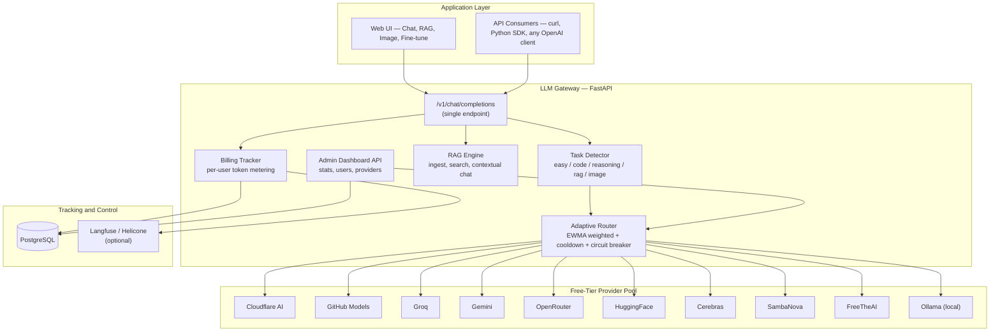
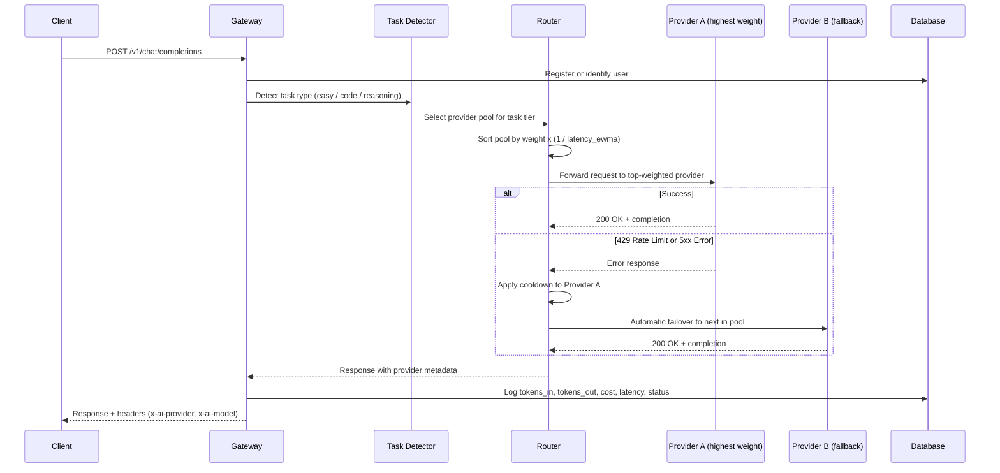
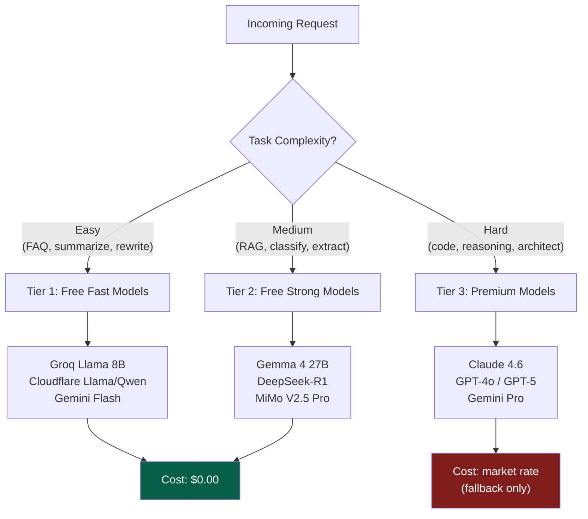
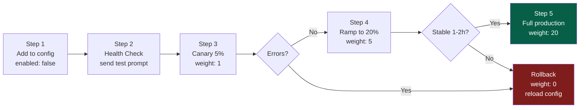
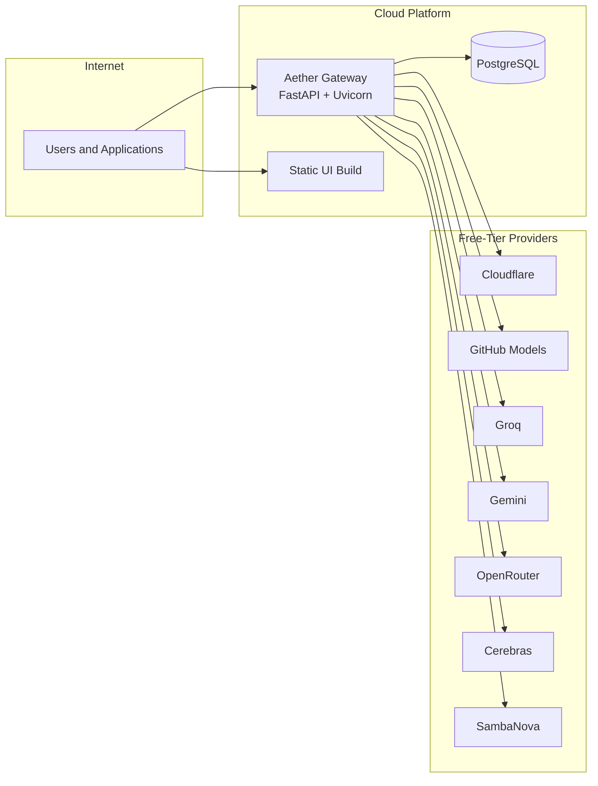

# Multi AI Agents Gateway

A self-hosted, zero-cost AI gateway that unifies 10+ free-tier LLM providers behind a single OpenAI-compatible endpoint. One endpoint, automatic provider selection, intelligent task routing, and real-time cost tracking — designed to reduce AI infrastructure costs by 90-95%.

---

## Table of Contents

1. [Architecture Overview](#architecture-overview)
2. [Request Routing Flow](#request-routing-flow)
3. [Tier-Routing Strategy](#tier-routing-strategy)
4. [Task Routing Matrix](#task-routing-matrix)
5. [Free-Tier Provider Catalog](#free-tier-provider-catalog)
6. [Cost Optimization Strategy](#cost-optimization-strategy)
7. [Tracking and Observability](#tracking-and-observability)
8. [Current Product Features](#current-product-features)
9. [Quick Start](#quick-start)
10. [API Reference](#api-reference)
11. [Configuration](#configuration)
12. [Provider Onboarding Workflow](#provider-onboarding-workflow)
13. [Deployment](#deployment)
14. [References](#references)

---

## Architecture Overview

The gateway implements a **Clean Router** architecture with three clearly separated layers: the Application Layer only calls one endpoint, the LLM Gateway handles all routing and failover logic, and the Providers Layer connects to the actual AI services.



---

## Request Routing Flow

Every request follows the same lifecycle: task detection, provider selection via EWMA-weighted scoring, automatic failover on failure, and metadata-enriched response.



### EWMA Routing Formula

The router uses Exponentially Weighted Moving Average to adapt in real-time:

```text
latency_ewma = alpha * new_latency + (1 - alpha) * old_ewma
effective_weight = base_weight * (1 - error_rate * penalty) / latency_ewma
```

Providers with lower latency and fewer errors receive proportionally more traffic. Failed providers enter cooldown automatically via circuit breaker logic.

---

## Tier-Routing Strategy



The gateway prioritizes free models first. 80% of typical workloads (chat, summarization, classification) can be served entirely by free-tier providers. Premium models are used only as a last-resort fallback for complex reasoning and architecture-level tasks.

---

## Task Routing Matrix

| Task Type | Free Model | Escalate When |
| --- | --- | --- |
| Chat / FAQ | Gemma 2, Groq Llama 8B | N/A |
| Short Summarization | Gemma 4, Groq Llama 8B | Long documents |
| Rewrite / Email | Gemma 2, Gemini Flash | Brand/legal tone required |
| Classify / Extract JSON | Cloudflare, Gemma 4 | Complex nested JSON |
| RAG Document Q&A | Gemma 4, Free chat models | Difficult context |
| Code / Debug | GitHub Models, DeepSeek, MiMo Pro | Architecture-level bugs |
| Reasoning | DeepSeek-R1, Gemma 4, MiMo Pro | GPT-4 / Claude needed |
| Embedding / Search | Cloudflare BGE, Gemma embed | Large-scale indexing |
| Image Generation | Cloudflare FLUX, HuggingFace FLUX | Production-grade images |

---

## Free-Tier Provider Catalog

| Provider | Model | Cost (In/Out) | RPM | Daily Limit | Notes |
| --- | --- | --- | --- | --- | --- |
| Groq | Llama 3.3 70B | $0 / $0 | 30 | ~14,400 | Fastest inference (LPU chip) |
| Groq | Llama 3.1 8B | $0 / $0 | 30 | ~14,400 | Ultra-fast for light tasks |
| Groq | Gemma 4 27B | $0 / $0 | 30 | ~14,400 | MoE, 3.8B active params |
| Google AI Studio | Gemini 2.5 Flash | $0 / $0 | 10-15 | ~1,500 | 1M context window |
| Google AI Studio | Gemini 2.5 Pro | $0 / $0 | 5 | ~50 | Frontier quality |
| Google AI Studio | Gemma 4 (all) | $0 / $0 | 10-15 | ~1,500 | Official, best support |
| GitHub Models | GPT-4o (via PAT) | $0 / $0 | ~10 | ~50 | Requires GitHub PAT |
| GitHub Models | Phi-4, Llama 3.1 | $0 / $0 | ~10 | ~50 | Wide model catalog |
| Cerebras | Llama 3.3 70B | $0 / $0 | 30 | ~1M tokens | Wafer-Scale Engine |
| Cloudflare | DeepSeek-R1 32B | $0 / $0 | 300+ | 10K Neurons | ~200 requests/day |
| Cloudflare | Llama 3.x/4, Qwen | $0 / $0 | 300+ | 10K Neurons | Many model choices |
| Cloudflare | Gemma 2 9B | $0 / $0 | 300+ | 10K Neurons | Previous generation |
| HuggingFace | Qwen 2.5 72B | $0 / $0 | ~10 | Rate-limited | Queue-based, slower |
| HuggingFace | Gemma 4 27B/31B | $0 / $0 | ~10 | Rate-limited | Serverless inference |
| OpenRouter | 33+ free models | $0 / $0 | 20 | ~200 | Use `:free` suffix |
| OpenRouter | Gemma 4 31B :free | $0 / $0 | 20 | ~200 | Dense, full power |
| SambaNova | Llama 3.1 405B | $0* | 10-20 | Credits-based | *$5 initial credits |
| Ollama (Local) | Any GGUF model | $0 / $0 | Unlimited | Unlimited | Requires local GPU |

---

## Cost Optimization Strategy

| Strategy | Savings | When to Use |
| --- | --- | --- |
| Free Tier substitution | 100% | 80% of simple tasks (chat, classify, summarize) |
| Batch API (non-realtime) | 50% | Background jobs, bulk processing |
| Prompt Caching | 75-90% | Repeated system prompts, similar RAG contexts |
| Model Routing (smart tier) | 60-80% | Use Gemma/Llama 8B instead of GPT-5 for simple tasks |
| Output token limiting | 20-40% | Set `max_tokens` to prevent verbose responses |

**Combined effect:** 90-95% reduction in AI infrastructure costs compared to using a single commercial provider.

---

## Tracking and Observability

The gateway tracks every request in real-time and exposes metrics through the Admin Dashboard and optional Langfuse integration.

**Metrics tracked per request:**

- Token count (input + output)
- Cost calculated per model's `cost_per_1k_tokens`
- Provider and model that served the request
- Response latency
- Status (success / 429 / 5xx / timeout)

**Dashboard displays:**

- Total cost by day/week/month
- Fallback ratio (how many requests hit rate limits)
- Load distribution across providers
- Token throughput (TPM, RPM)
- Cost per task type
- Model usage breakdown

| Tool | Type | Key Features | Self-host | Cost |
| --- | --- | --- | --- | --- |
| Built-in Admin | Dashboard | Per-user billing, provider matrix, live console | Included | Free |
| Langfuse | Observability | Token tracking, cost/session, prompt management | Yes | Free (MIT) |
| Helicone | Gateway + Obs | Proxy logging, response caching, latency analysis | Yes | Free (OSS) |
| LiteLLM | Gateway/Proxy | Load balancing, fallback, cost tracking | Yes | Free (MIT) |
| Bifrost | Gateway (Go) | Ultra-low latency (<1ms overhead) | Yes | Free (OSS) |
| TensorZero | Gateway (Rust) | Inference optimization, A/B testing | Yes | Free (OSS) |

---

## Current Product Features

- FastAPI gateway with OpenAI-compatible `/v1/chat/completions` endpoint
- Web UI with multiple modes: Chat, RAG, Fine-tune Profile, RAG + Fine-tune, Image/Flux
- Image generation pipeline: Cloudflare FLUX > HuggingFace FLUX > Public Fallback
- Prompt compiler: consolidates short Vietnamese prompts to reduce image generation errors
- Adaptive router: weighted routing, EWMA latency/error tracking, retry, cooldown/circuit-breaker
- Diagnostics endpoints: `/health`, `/providers`, `/router/models`, `/router/state`, `/metrics`
- Benchmark tooling: success rate, throughput, p50/p95/p99, model distribution, status breakdown
- Per-user billing: automatic guest registration, token metering, revenue tracking
- Admin Dashboard: cinematic UI with real-time telemetry, provider matrix, user ledger

---

## Quick Start

### 1. Clone and install

```bash
git clone https://github.com/nleins5/free-ai-gateway.git
cd free-ai-gateway

python3 -m venv venv
source venv/bin/activate
pip install -r requirements.txt
```

### 2. Configure environment

```bash
cp .env.example .env
# Fill in API keys for providers you have access to
# Providers without keys are automatically excluded from routing
```

### 3. Start the gateway

```bash
uvicorn app.main:app --host 0.0.0.0 --port 8000
```

### 4. Start the Web UI

```bash
cd ui && npm install && npm run dev
```

### 5. Access points

| Service | URL |
| --- | --- |
| API Endpoint | `http://localhost:8000` |
| Web Chat UI | `http://localhost:5173` |
| Admin Dashboard | `http://localhost:5173/admin` |

---

## API Reference

### Chat Completion

```bash
curl http://localhost:8000/v1/chat/completions \
  -H "Content-Type: application/json" \
  -d '{
    "model": "smart-chat",
    "messages": [{"role": "user", "content": "Explain microservices architecture"}],
    "temperature": 0.3
  }'
```

Response includes routing metadata via headers (`x-ai-provider`, `x-ai-model`) and body (`router.provider`, `router.model`).

### Model Aliases

| Alias | Behavior |
| --- | --- |
| `smart-chat` | Auto-select best available provider based on EWMA weights |
| `gemma-fast` | Prefer speed — routes to smallest/fastest models |
| `gemma-quality` | Prefer quality — routes to 27B+ models when available |
| `cf-dynamic` | Force Cloudflare AI Gateway dynamic route |

### Other Endpoints

| Endpoint | Method | Description |
| --- | --- | --- |
| `/v1/chat/completions` | POST | Standard chat completion |
| `/v1/images/generations` | POST | Image generation (FLUX pipeline) |
| `/v1/rag/ingest` | POST | Ingest documents into RAG store |
| `/v1/rag/search` | POST | Search RAG context |
| `/v1/rag/chat` | POST | Chat with RAG-augmented context |
| `/v1/fine_tune/chat` | POST | Chat with fine-tune profile |
| `/v1/rag/fine_tune/chat` | POST | RAG + fine-tune combined |
| `/router/models` | GET | View model alias mappings |
| `/router/state` | GET | Router health state + cooldowns |
| `/metrics` | GET | Prometheus-style metrics export |
| `/v1/admin/stats` | GET | Aggregate system stats (auth required) |
| `/v1/admin/providers` | GET | Provider details (auth required) |
| `/v1/admin/users` | GET | User billing data (auth required) |

---

## Configuration

### Key environment variables

| Variable | Description | Default |
| --- | --- | --- |
| `PROVIDER_CHAIN` | Comma-separated provider routing order | `cloudflare,github,groq,...` |
| `ROUTING_MODE` | `weighted`, `round-robin`, or `priority` | `weighted` |
| `ADAPTIVE_ROUTING` | Enable EWMA-based adaptive weight adjustment | `1` |
| `ADAPTIVE_LATENCY_ALPHA` | EWMA smoothing factor (alpha) | `0.3` |
| `PROVIDER_WEIGHTS_JSON` | Baseline traffic share per provider | `{"cloudflare":4,"github":2}` |
| `PROVIDER_FAILURE_THRESHOLD` | Consecutive failures before cooldown | `3` |
| `PROVIDER_COOLDOWN_S` | Cooldown duration in seconds | `60` |
| `BUDGET_LIMIT_USD` | Daily budget cap (0 = unlimited) | `0` |
| `ADMIN_SECRET` | Admin dashboard authentication key | (required) |
| `DATABASE_URL` | PostgreSQL connection string | `sqlite+aiosqlite:///local.db` |

### Provider keys

Fill in only the providers you have. Missing keys cause the provider to be silently excluded:

```env
CLOUDFLARE_API_TOKEN=...
CLOUDFLARE_ACCOUNT_ID=...
GITHUB_PAT=ghp_...
GROQ_API_KEY=gsk_...
OPENROUTER_API_KEY=sk-or-...
GEMINI_API_KEY=...
HF_TOKEN=hf_...
CEREBRAS_API_KEY=...
SAMBANOVA_API_KEY=...
FREETHEAI_API_KEY=...
```

---

## Provider Onboarding Workflow

Adding a new provider to production without downtime:



**Config reload without downtime:**

```bash
# Hot reload (no restart required)
curl -X POST http://gateway:4000/config/reload

# Docker — reload config only
docker exec gateway litellm --config /etc/litellm/config.yaml --reload

# File watch — auto-reload on config change
litellm --config config.yaml --watch
```

---

## Deployment

### Render (recommended for free hosting)

The project includes a `render.yaml` blueprint. Push to GitHub, connect the repo in Render dashboard, and the service auto-configures.

### Docker

```bash
docker build -t aether-gateway .
docker run -p 8000:8000 --env-file .env aether-gateway
```

### Production Topology



---

## Project Structure

```text
free-ai-gateway/
  app/
    main.py                  # FastAPI entry point
    api/
      v1/chat.py             # Chat completions + user billing
      admin.py               # Admin dashboard API
    services/
      router.py              # Adaptive EWMA weighted router
      rag.py                 # RAG engine (ingest, search, chat)
  ui/
    src/
      pages/
        Chat.jsx             # Chat interface (multi-mode)
        Admin.jsx             # Admin telemetry dashboard
      App.jsx                # Router + layout
  providers.json             # Provider configuration
  .env.example               # Environment template (safe to commit)
  Dockerfile                 # Container build
  render.yaml                # Render deployment blueprint
```

---

## References

- [LiteLLM](https://github.com/BerriAI/litellm) — Multi-provider gateway proxy
- [Langfuse](https://langfuse.com/) — Self-hosted LLM observability
- [Helicone](https://github.com/Helicone/ai-gateway) — AI gateway with logging
- [Bifrost](https://github.com/maximhq/bifrost) — Ultra-low latency gateway (Go)
- [TensorZero](https://github.com/tensorzero/tensorzero) — Inference optimization (Rust)
- [Portkey](https://portkey.ai/) — Enterprise AI gateway
- [Cloudflare Workers AI](https://developers.cloudflare.com/workers-ai/)
- [GitHub Models](https://docs.github.com/en/github-models)
- [Groq Console](https://console.groq.com/)
- [Google AI Studio](https://aistudio.google.com/)
- [OpenRouter](https://openrouter.ai/docs)
- [HuggingFace Inference](https://huggingface.co/docs/inference-providers/index)
- [Cerebras](https://cerebras.ai/)
- [SambaNova](https://sambanova.ai/)
- [xAI Grok API](https://docs.x.ai/)
- [Xiaomi MiMo](https://mimo.mi.com/)

---

## License

MIT
